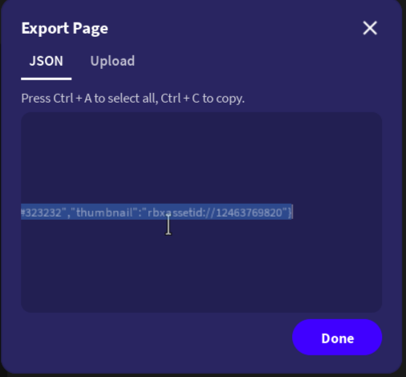

# Guides: Decompiling

Reverse-engineer CatWeb JSON back to CatLang source code and CatUI DSL.

## Overview

The decompiler converts CatWeb JSON → `.cat` source (for editing) + `.catui` DSL (for UI layout):

```
CatWeb JSON → [Extract Scripts] → [Decompile Actions] → .cat file per script
           → [Extract UI] → [Decompile to CatUI DSL] → page.catui
           → [Page Metadata] → page-level properties in CatUI DSL
```

## Decompile Process

### 1. Action Decompilation

CatWeb's flat `END`-terminated action array is converted to indented blocks:

```
LOG "hello"         →  log("hello")
IF_EQ a, b          →  if eq(a, b):
    LOG "equal"     →      log("equal")
ELSE                →  else:
    LOG "not equal" →      log("not equal")
END                 →  
```

The decompiler uses a **stack** to track open blocks (IF, REPEAT, FOREACH) and their bodies.

### 2. Output Variable Detection

Using the CatWeb schema, the decompiler knows which action slots are outputs:

```python
# TABLE_SET (id 55): no output → plain call
table_set("fg", "colors", "eaeaea")

# TABLE_GET (id 56): output at index 2 → assignment
o_bgColor = table_get("bg", "app_config")

# GET_VIEWPORT (id 84): outputs at indices 0 and 1
WIDTH, HEIGHT = input_get_viewport()
```

Optional outputs with `""` value are skipped:
```python
func_run("function", arg)  # No assignment for empty optional output
```

### 3. Dict Literal Detection

The decompiler detects TABLE_CREATE + consecutive TABLE_SET patterns:

```python
# Detected pattern:
# TABLE_CREATE "default"
# TABLE_SET "l", "default", "ebecd0"
# TABLE_SET "d", "default", 779556
# TABLE_SET "colors", "app_config", colors

# Output:
colors = {"bg": "1a1a2e", "fg": "eaeaea"}
table_set("colors", "app_config", colors)
```

### 4. Scope Variable Handling

`l!var` → `l_var`, `o!header` → `o_header`

Variables with dashes in names (`icy-tea`) use underscore: `icy_tea`

### 5. Path-Based References

When a `.catui` paths map is available, global IDs are resolved to page paths:

```python
# Without .catui:
hide("G\"")
look_set_prop("Background Color", "o!header", "ebecd0")

# With .catui:
hide(page.LoadingScreen)
look_set_prop("Background Color", o_header, "ebecd0")
```

## Exporting from CatWeb

Before decompiling, export your site from the CatWeb editor:

1. **Select the page element**: click the page root in the CatWeb editor hierarchy

   

2. **Press Export**: click the export button to generate the page JSON

   

3. **Copy the JSON**: the full page JSON is now on your clipboard, ready to save as `page.json`

   

Save the copied JSON to a file (e.g. `page.json`) and proceed with the CLI or editor import below.

## Using the Decompiler

### CLI

Two commands for different use cases:

```bash
# Full round-trip: scripts + UI layout + project config
cpile decompile page.json -o output-dir/

# UI layout only: just the CatUI DSL, no scripts
cpile catui page.json -o layout.catui
```

`decompile` produces:
- `{alias}.cat` — one `.cat` file per script (aliased or indexed)
- `page.catui` — UI layout as CatUI DSL, with page-level metadata and element hierarchy
- `.catpilerc` — ready-to-use project config for `cpile build`

`catui` produces only the `.catui` file. Use it when you already have your `.cat` scripts and just want the UI layout as readable DSL.

Or use the standalone entry point:

```bash
cpile-decompile page.json -o output-dir/
```

### Web API

```bash
curl -X POST https://cpile.bouyakhsass.com/api/decompile \
  -H "Content-Type: application/json" \
  -d @page.json
```

Returns: `{"script.cat": "...", "page.catui": "...", ".catpilerc": "..."}`

### Editor Import

1. Open [cpile.bouyakhsass.com](https://cpile.bouyakhsass.com)
2. Click **Import**
3. Paste CatWeb JSON
4. Scripts appear in Explorer, decompiled and editable

## What Gets Decompiled

| CatWeb Feature | Decompiled As |
|---|---|
| `id: 0` → "When website loaded..." | `on loaded:` |
| `id: 1` → "When button pressed..." | `on pressed(target):` |
| `id: 11` → "Set variable to value" | `var = value` |
| `id: 87` → "Run function" | `func_run("name", args)` |
| `id: 54` → "Create table" | `create_table("name")` |
| `id: 18` → "If equal" | `if eq(a, b):` |
| `id: 23` → "Repeat forever" | `repeat_forever:` |
| `id: 113` → "Iterate through" | `foreach("table"):` |
| `id: 115` → "Return" | `return value` |
| `mappings.py` → action aliases | `log`, `show`, `hide`, etc. |
